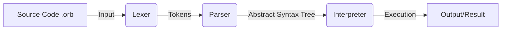

# 🪐 Orbit Programming Language

> **Version:** 0.3 (The Interpreter and Runtime Engine)  
> **Developed by:** Sphare Co.  
> **Status:** Active Development (Phase 1)

**Orbit** is a futuristic, dual-language programming language designed to bridge the gap between English and Hindi speakers. It allows developers to write code using **Hinglish (Hindi+English)** syntax.

Current capabilities include **Lexical Analysis (Tokenization)** and **Syntax Analysis (AST Generation)**.

---

## 🚀 What's New in v0.3?
In this version, we have added the **Interpreter Engine**. Orbit is no longer just "checking" code; it is now **running** it!

- **Runtime Execution:** The code actually runs and produces output.
- **Data Types:** Support for `Number` (Double), `String` (Text), and `Boolean` (True/False).
- **Hinglish Booleans:** Outputs `sahi` for `true` and `galat` for `false`.
- **Visitor Pattern:** Implemented a robust Visitor architecture to traverse the AST.

---


## 🛠️ Architecture

How Orbit processes your code:


- **Lexer:** Breaks code into Tokens (e.g., manlo, =, 10).

- **Parser:** Organizes tokens into a hierarchical Tree structure (AST).

- **Validator:** Checks if the grammar rules (Syntax) are followed.
- **Interpreter:** Walks through the Tree and executes logic (e.g., Printing values).
## 📂 Keyword Mapping (Dual Mode)
You can use either English or Hindi keywords. Both work simultaneously!

| Token Type | English Keyword | Hindi Keyword |
| :--- | :--- | :--- |
| Variable | `let` | `manlo` |
| Print | `print` | `bol` |
| Condition | `if` | `agar` |
| Else | `else` | `warna` |

## 🛠️ How to Build & Run (Cross-Platform)

Orbit is written in standard C++, so it runs on **Windows, macOS, and Linux**.

### ✅ Prerequisites
You need a C++ Compiler installed on your system:
- **Windows:** MinGW (G++) or Visual Studio.
- **Mac:** Xcode Command Line Tools (`clang++`).
- **Linux:** GCC (`g++`).

---

### 🪟 Windows

1.  **Open Terminal:** Open PowerShell, CMD, or VS Code Terminal.
2.  **Navigate to Source:**
    ```powershell
    cd src
    ```
3.  **Compile:**
    ```powershell
    g++ main.cpp Lexer.cpp Parser.cpp -o orbit
    ```
4.  **Run:**
    ```powershell
    .\orbit.exe ..\examples\test.orb
    ```

---

### 🐧 Linux (Ubuntu/Debian/Fedora)

1.  **Install GCC (if not installed):**
    ```bash
    sudo apt update && sudo apt install build-essential
    ```
2.  **Navigate to Source:**
    ```bash
    cd src
    ```
3.  **Compile:**
    ```bash
    g++ main.cpp Lexer.cpp Parser.cpp -o orbit
    ```
4.  **Run:**
    ```bash
    ./orbit ../examples/test.orb
    ```

---

### 🍎 macOS

1.  **Install Compiler (if not installed):**
    Open terminal and type:
    ```bash
    xcode-select --install
    ```
2.  **Navigate to Source:**
    ```bash
    cd src
    ```
3.  **Compile:**
    ```bash
    g++ main.cpp Lexer.cpp Parser.cpp -o orbit
    ```
4.  **Run:**
    ```bash
    ./orbit ../examples/test.orb
    ```

### Expected Output:
```sh
---Orbit Lexer Output(Tokens)---
Token ID: 1 || Token value: manlo
Token ID: 4 || Token value: name
Token ID: 7 || Token value: =
Token ID: 6 || Token value: Orbit Lang
Token ID: 12 || Token value: ;
Token ID: 0 || Token value: bolo
Token ID: 4 || Token value: name
Token ID: 12 || Token value: ;
Token ID: 1 || Token value: let
Token ID: 4 || Token value: version
Token ID: 7 || Token value: =
Token ID: 5 || Token value: 2
Token ID: 12 || Token value: ;
Token ID: 0 || Token value: print
Token ID: 4 || Token value: version
Token ID: 12 || Token value: ;
Token ID: 0 || Token value: bolo
Token ID: 6 || Token value: Testing Complete
Token ID: 12 || Token value: ;
Token ID: 13 || Token value:

---Parsing Successfull---
Total Statements: 5
```
### 🗺️ Roadmap Status
- [x] v0.1: Lexer (Tokenization Engine) - Completed

- [x] v0.2: Parser (AST & Syntax Check) - Completed ✅

- [ ] v0.3: Interpreter (Maths & Execution) - Next Step

**Note:** This version validates the syntax but does not yet execute mathematical logic (like 5+5). That feature is coming in **v0.3**.